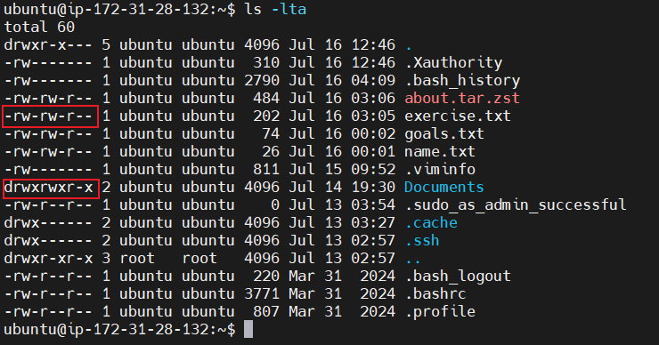
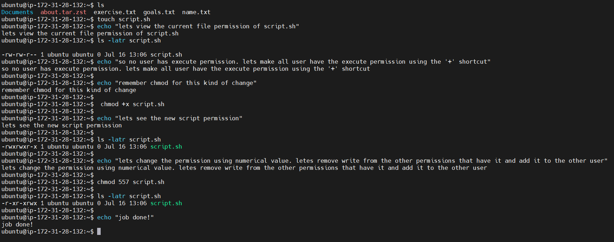

# Advance linux command (file permission)

**file permission and ownership** is vital for controlling who can access, modify, or execute files and directories this concept helps maintain the security and integrity of your system. 

## concepts for file permissions and ownership

In linux, permissions assignable are generally `read` , `write` and `execute` which can be assigned using numerical values or symbolics (rwx) 

- no permission = 0
- read = 4
- write = 2
- execute = 1 

These values are combined to represent the permissions for each user class under consideration which are: 
- Owner: The person who created the file. Often referred to as 'user'
- Group: A collection of users who share certain permissions for the file.
- Others: Anyone else who has access to the computer but doesn't fall into the first two categories. e.g manager in the dev team.

examples of permission 

### permissions Represented by 7 
- 4(read) + 2(write) + 1(execute) = 7
- Symbolic: rwx
- the means this user can read the file, write to it(modify it), and execute it if its executable.

### permission represented by 5
- 4(read) + 1(execute) = 5
- Symbolic: r-x
- user can only read and execute the file.

The permission which isn't given to the user are denoted by hyphen ( - ).

-the d in the highlight represent directory, if its missing that means its a file.

- the next three characters represent the permission of the `owner `

- the next three characters represent the permission for `group`

- the last three characters represent the permission for `others`

## commands for file permission
 *chmod command*

 this allows the changing or modifying of file permissions. we can use both symbolic and numeric representations to assign permissions to the user, group and others.

 

 *chown command*

 change owner ownership of files, directories, and symbolic links to a specified username or group.

 format `chown [option] owner[:group] file(s)`

 For example, lets assume there is a user on the server called *john*, a group on the server called *"developers"* and you want the owner of `filename.txt` changed from `dare` to `john`, and to also ensure that any user in the developer group has ownership of the file as well:

 > chown john:developer filename.txt

It is often necessary to become the superuser to perform important tasks in linux, but as we know, we should not stay logged in as the superuser. In most linux distributions, there is a command that can give you temporary access to the superuser's privileges. This program is called sudo (short for super user) and can be used in those cases when you need to be the superuser for a small number of tasks. To use the superuser privilledes, simply type `sudo` before the command you will be invoking.

To switch to the root user, simply run

> sudo -i

